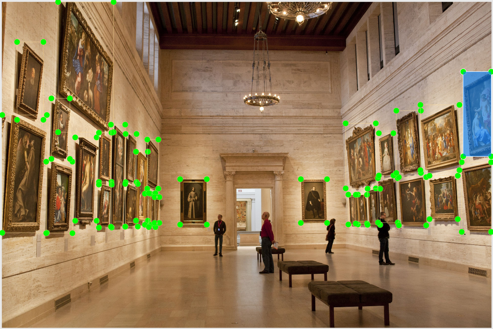
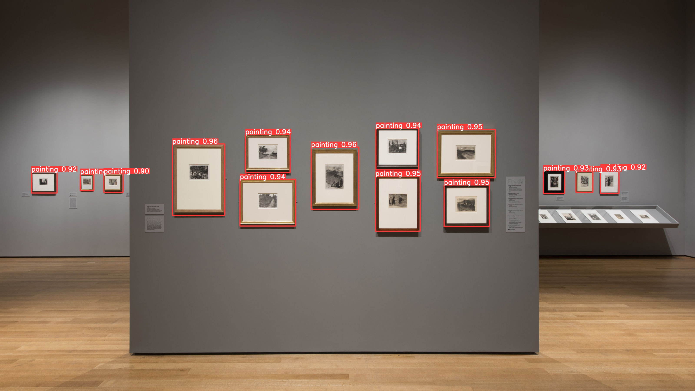
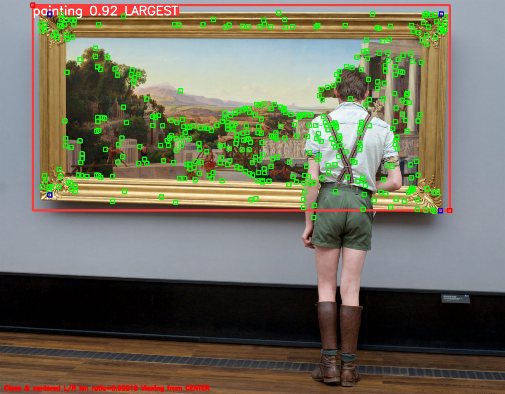
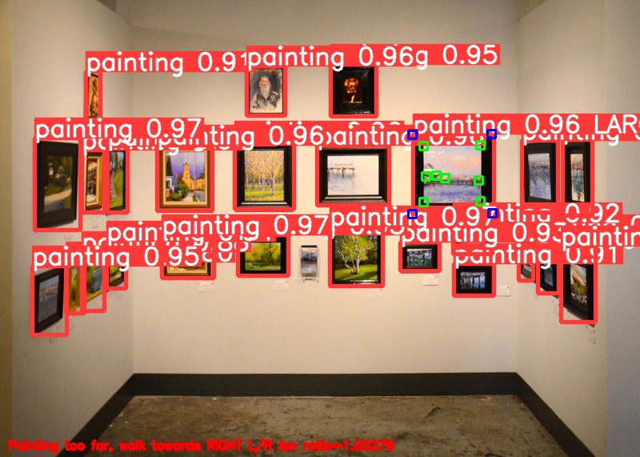
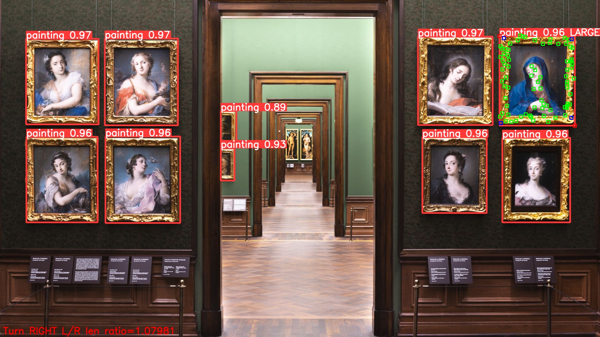
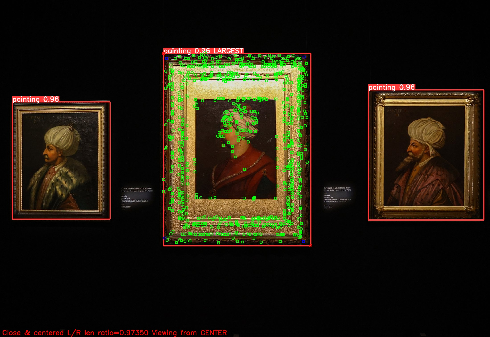
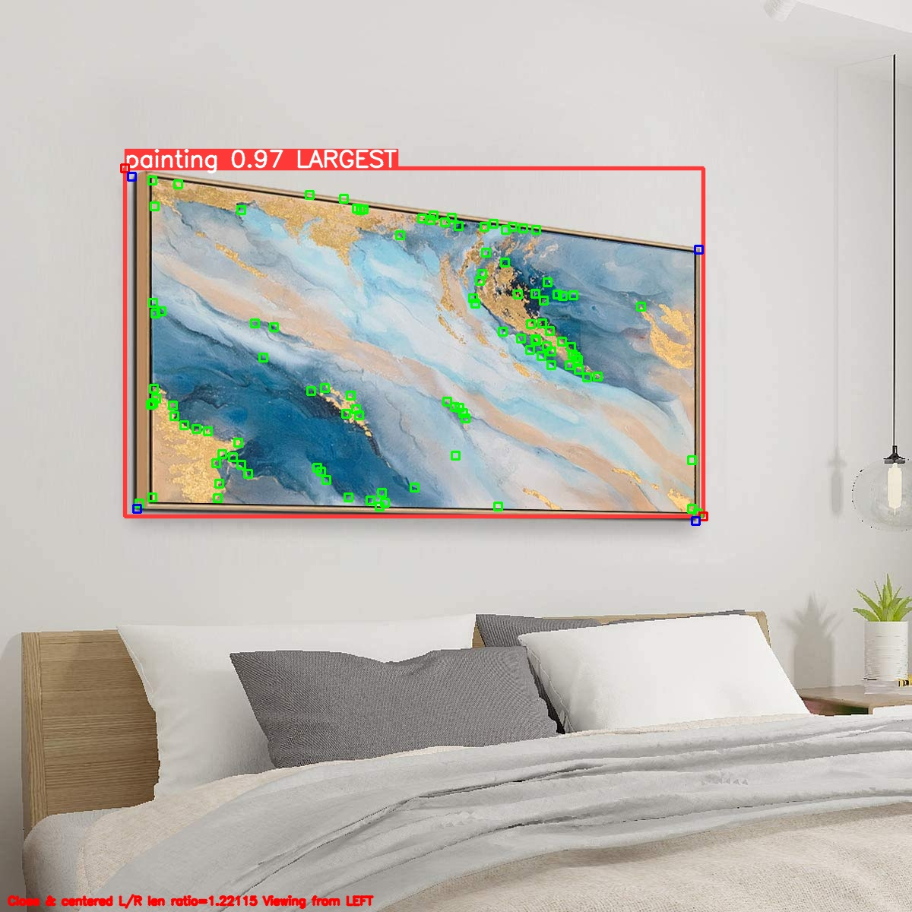

# ArtView ALigner
## Problem Statement:
This project aims to build a model that can identify all the paintings in a given image and direct the user to face the largest painting properly. This could be used in conjunction with models that describe images or art to visually impaired people as making them face the art correctly produces better results from the description models.

## Dataset Creation:
Around 370 images were scraped from the internet using the tool `google-image-download`. The search queries used were synonymous to ‘paintings in museum’ and ‘museum art collection’. There were also 30 background images with no art added to the dataset. The dataset split was 271, 70, 36 images for the train, validation and the testing sets.

All these images were labeled in the YOLO-xywh format using the tool `labelImg`. Most of the images are densely labeled as they have a lot of paintings in them. The only class label used is ‘Painting’ which is not present in the 80 classes that YOLOv5 is trained on. 

The images were carefully labeled to get all the corners of the paintings in the bounding boxes.

## YOLO:
The YOLOv5 model provided by Ultralytics was trained on the dataset for 100 epochs obtaining an mAP(IoU = 0.5) of 96.7% and an mAP(IoU = 0.5 : 0.95) of 82.6%. An example detection is shown below.

## Failed attempts with edges and corners:
The next problem to solve is detecting whether the user is viewing the painting from an angle. The first strategy was to get the lines of the frame edges through Hough transform and measure the slope of the top and the bottom lines to know which way one is facing the painting from.

Some complications with this approach are as follows:
- Once the hough transform gives us the lines, we should find a way of identifying which of those lines belong to the frame edges (top and bottom) and which ones are random and useless. Given the number of lines it was outputting, this was a hard task.
- We should differentiate between the bottom and the top frame edges as well but this can’t be done with slope alone because the slopes get reversed when the viewing direction is reversed.
- If the height of the camera matches the bottom edge of the frame, it always stays at slope zero. Depending on the height of the camera, this splits the whole problem into 5 different cases - the camera height below the bottom frame edge, on the bottom frame edge, in between the bottom and the top frame edge, on the top frame edge and above the top frame edge. All these have to be dealt with differently.

The second strategy was to try Harris corner detector which was slightly better than the Hough transform case but ended up giving too many potential corners in the background. One way this could be corrected was to perform Gaussian blurring on images with a kernel size of (21, 21). 

The rationality behind this was that most of the background corners were caused by fine lines unlike the frame edges which are very coarse. This solved the problem of too many potential corners and also completely eliminated the need for Hough transforms.

Ultimately, applying Harris corner detector on blurred images and getting the largest bounding box from YOLO lead to the elimination of all potential corners in the image except the ones on the largest painting. Four of these filtered corners represent the four vertices of the painting frame.

## Finding the four corners of the frame:
Given the numerous potential corners (represented in green) that fall inside and slightly beyond the bounding box (represented in red), how do we find four of them (shown in blue) that are the most representative of the frame corners? 

This problem seems similar to a Convex Hull problem except we need only four vertices and all the points need not be inside the quadrilateral. We are only looking for some good approximation of the actual frame corners.

A few ways I approached this problem are as follows:
- Find the convex hull of all the potential corners and then find a combination of four corners among them that have the highest quadrilateral area. The time complexity of this solution is O(n^4) which is very high given the number of potential corners we have. Also, calculating the area of quadrilaterals of different shapes is not a trivial task.
- Find the convex hull of all the potential corners and try to find four points that have extreme values of x and y. This approach did not work at all because the points with the extreme values might not even be near the corners of the frame. The corner detection algorithm could put a potential corner with the highest y value at the midpoint of a frame edge and that would render this solution inaccurate.
- The solution that seemed most robust is based on the intuition of maximizing areas. If we need to find the best point to represent the top right corner, find the rectangular areas that each of these points make with the diagonally opposite (bottom right) corner of the bounding box. The point that has the maximum area makes a great candidate. The area calculation gets the overall best point instead of swaying towards extreme x or y values. This approach works very well when the corner detection algorithm produces enough potential corners and also has linear time complexity.

## Finding the angle:
Given the four corners that represent the frame corners, how do we estimate if we are looking at the painting from the left or right?

This could be solved by getting the slopes of the top and bottom lines but we would have to deal with the five cases that arise from varying camera height relative to the painting. A simpler way to solve this is to get the ratio of the left and 	the right edges of the frame as these edges don’t have the same length unless we are facing the frame perfectly.

## Guiding Procedure with Examples::
1. Fit bounding boxes around all the paintings greater than the confidence level and keep track of the largest one.
2. If there are no paintings in the image, say `No paintings detected`.
3. If the bounding box of the largest painting does not measure up to at least 25% of the image size on one of the axes, say `Painting too far, walk towards LEFT/CENTER/RIGHT` depending on where the painting is.

  

4. If the bounding box is large enough, but its center does not lie in the middle third of the image, say `Turn LEFT/RIGHT` accordingly to get the largest painting to the center.

  

5. Once the largest bounding box is close enough and in the center third of the image, say `Close and centered`.

  

6. Then perform corner detection on the largest bounding box to visualize the corners of the painting.
7. Find the left to right frame edge length ratio (L/R) using the corners found.
8. If the bounding box is `Close and centered`, if the ratio is in the range of [0.9, 1.1], say `Viewing from center`. If the ratio > 1.1, say `Viewing from left` and if ratio < 0.9, say `Viewing from right`.

  

## Results:
To evaluate the model’s performance in unknown environments, I collected some pictures from the Engineering Center and uploaded the predictions in the [results](./results) folder. The user directions seem to be correct most of the time.

## Limitations:
- This algorithm works only on paintings with rectangular frames. If the shape of the frame is different, it will mislead the user into the wrong direction.
- It tends to give wrong results when the frame is only partially present in the image especially near the left or right corners.
- It also only directs the user towards the largest painting. It assumes that the largest painting changes if the user keeps moving around as some paintings get out of the image.
- Sometimes, when the corner detection algorithm doesn’t give proper corner candidates, this tends to give wrong results.

## Future work:
- Performing detection real-time and adding audio directions to the user instead of text.
- Adding functionality that also describes the painting once the user is directed towards it properly.
- Improve/tune the corner detection algorithm to include the actual frame corners all the time.

